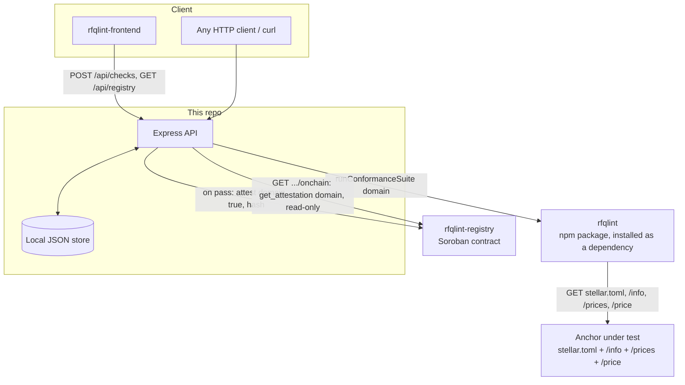
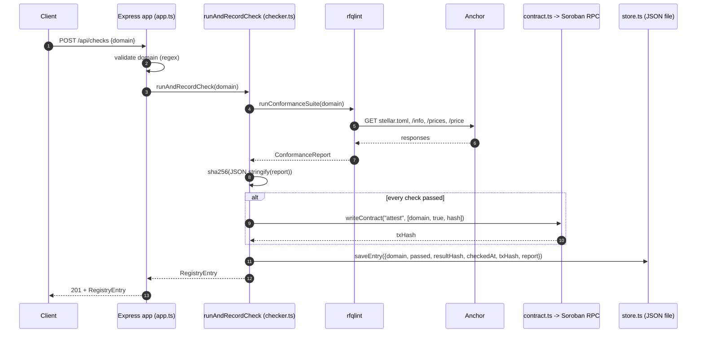

# rfqlint-backend

The API service behind the SEP-38 conformance checker: runs the checks
and publishes results to the on-chain
[`rfqlint-registry`](https://github.com/RFQLint/rfqlint-registry).
Structurally the same service as
[`sep24-conformance-backend`](https://github.com/SEP-24-conform/sep24-conformance-backend)
and
[`sep31-conformance-backend`](https://github.com/sep31-conformance/sep31-conformance-backend),
retargeted at SEP-38's discovery surface.

Four repos make up this project:

- [`rfqlint`](https://github.com/RFQLint/rfqlint) — the core checking library + CLI. This backend depends on it directly (as a package, not a copy).
- [`rfqlint-registry`](https://github.com/RFQLint/rfqlint-registry) — the Soroban contract this backend writes results to.
- **This repo** — the API a frontend (or anyone) can call to trigger a check and browse results.
- [`rfqlint-frontend`](https://github.com/RFQLint/rfqlint-frontend) — dashboard over this API.



## Table of contents

- [What it does](#what-it-does)
- [Endpoints](#endpoints)
- [Request lifecycle: POST /api/checks](#request-lifecycle-post-apichecks)
- [Trust model](#trust-model)
- [Configuration](#configuration)
- [Running locally](#running-locally)
- [Testing](#testing)
- [Project layout](#project-layout)
- [Storage](#storage)
- [Key management](#key-management)
- [Design decisions](#design-decisions)
- [Operational considerations](#operational-considerations)
- [FAQ](#faq)
- [Contributing](#contributing)
- [License](#license)

## What it does

```
POST /api/checks {"domain": "testanchor.stellar.org"}
  → runs the full rfqlint suite against that domain
  → hashes the report (sha256)
  → if every check passed, signs and submits an `attest` call to the
    registry contract with that hash
  → persists the result locally and returns it
```

Real output from this exact service, checking SDF's live test anchor —
and a genuine `passed: false`, not a hypothetical failure case:

```json
{
  "domain": "testanchor.stellar.org",
  "passed": false,
  "txHash": "",
  "report": {
    "results": [
      { "id": "toml-fetch", "status": "pass" },
      { "id": "toml-quote-server", "status": "pass" },
      { "id": "info-reachable", "status": "pass" },
      { "id": "info-json", "status": "pass" },
      { "id": "info-shape", "status": "pass" },
      { "id": "prices-shape", "status": "pass" },
      { "id": "price-json", "status": "fail", "message": "HTTP 502, and the body failed to parse as JSON..." }
    ]
  }
}
```

SDF's own reference anchor's `/sep38/price` endpoint is genuinely down
right now (see
[`rfqlint`'s README](https://github.com/RFQLint/rfqlint#a-real-bug-this-tool-found-in-sdfs-own-reference-anchor)) —
this backend correctly declines to publish an attestation for it, exactly
as designed.

## Endpoints

| Method & path | Description |
|---|---|
| `GET /healthz` | Liveness check. |
| `POST /api/checks` | Body `{ "domain": "..." }`. Runs a fresh check, publishes an attestation on pass, returns the full report. |
| `GET /api/checks/:domain` | Returns the last stored check for `domain` without re-running it. 404 if never checked. |
| `GET /api/registry` | Lists every domain this backend has checked, with pass/fail and tx hash. |
| `GET /api/registry/:domain/onchain` | Reads the attestation **directly from the contract**, bypassing this backend's local store entirely. |

`domain` is validated against a hostname regex before any network call is
made.

## Request lifecycle: POST /api/checks



## Trust model

Same as both sibling backends: this service is the single point of trust
for *writes* (it holds the only key authorized to call `attest`), but not
for *reads* — `/api/registry/:domain/onchain` queries the contract
directly, independently verifiable by anyone with the contract ID and any
Soroban RPC endpoint.

## Configuration

| Variable | Required | Default | Description |
|---|---|---|---|
| `STELLAR_SECRET_KEY` | **yes** | — | Secret key of the account holding admin rights on the registry contract. |
| `CONTRACT_ID` | no | testnet registry contract ID | Which registry contract to read/write. |
| `SOROBAN_RPC_URL` | no | `https://soroban-testnet.stellar.org` | Soroban RPC endpoint. |
| `NETWORK_PASSPHRASE` | no | `Test SDF Network ; September 2015` | Must match the network the RPC endpoint and contract are on. |
| `PORT` | no | `3003` | HTTP listen port. |
| `STORE_PATH` | no | `./data/registry.json` | Where the local cache is written. |

## Running locally

```sh
cp .env.example .env   # fill in STELLAR_SECRET_KEY
npm install
npm run build
npm start
```

## Testing

```sh
npm test
```

10 tests. Two are genuinely real end-to-end:

- A domain with no SEP-38 support (`example.com`) correctly fails,
  recorded locally, never reaches the chain.
- A mock anchor with fully conformant `/info`, `/prices`, and `/price`
  responses triggers a real testnet write, then reads the result back
  **directly from the contract** (not the local store) to prove it
  actually landed on-chain.

Manually verified separately against the real `testanchor.stellar.org`:
correctly produces `passed: false` and skips the on-chain write, because
that anchor's `/price` endpoint is genuinely broken right now — see
[What it does](#what-it-does).

## Project layout

```text
src/
  app.ts        Express app: routes, validation, error handling
  server.ts      process entry point
  checker.ts      orchestrates: run check -> hash -> attest if passing -> persist
  contract.ts      Soroban RPC integration
  store.ts         local JSON-file persistence
  config.ts        env var loading
test/
  app.test.ts
  checker.test.ts   includes the real-network test above
  fixtures/mock-anchor.ts
```

## Storage

A single JSON file, read-modify-written under an in-process promise chain
so concurrent requests can't clobber each other's writes. Not a real
database — see [Design decisions](#design-decisions).

## Key management

Generated fresh, specifically for this backend, via `Keypair.random()` in
a script whose only output was the public key — the secret was written
straight to a local `.env` file (`mode 0o600`) and never printed,
logged, or committed. Contract admin was then rotated (`set_admin`) to
this key, matching both sibling backends' key-handling practice exactly.

## Design decisions

**Why a flat JSON file instead of a real database?** Proportionate to
current scale — one operator-run instance, caching data that's
independently reconstructible from the chain and from re-running checks.
Same reasoning as both sibling backends.

**Why does a failing check never reach the chain?** A negative
attestation isn't a claim anyone benefits from having on-chain
permanently, and would mean paying a transaction fee for checks that
fail for reasons as mundane as a typo'd domain.

**Why does `rfqlint` install as a git dependency instead of
being published to npm?** Same reasoning as both siblings: one source of
truth, no risk of a vendored copy drifting from upstream.

## Operational considerations

Same caveats as both sibling backends: no authentication on any endpoint,
single-instance-only storage, no retry/backoff on Soroban RPC calls.

## FAQ

**Can I point this at mainnet?** The code has no testnet-specific
logic — `NETWORK_PASSPHRASE`, `SOROBAN_RPC_URL`, and `CONTRACT_ID` are all
configurable.

**What happens if the anchor I'm checking doesn't support SEP-38 at
all?** The check fails cleanly at `toml-quote-server` and is recorded as
`passed: false` — no exception, since "this anchor doesn't do SEP-38" is
itself a valid, expected outcome.

## Contributing

Same open gaps as both sibling backends (auth, retry/backoff,
multi-instance support, skip-if-unchanged) — worth tracking as linked
issues across all three rather than solving each independently.

## License

Apache-2.0
